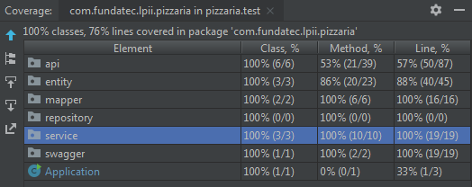

# Pizzaria
###### Este é o trabalho de conclusão da disciplina Linguagem de Programação II do Técnico de Informática da FUNDATEC.

## Especificação Recebida
Uma pizzaria deseja automatizar o sistema de comandas, isso funcionaria assim:
 
- O cliente pegaria a mesa A, na mesa A, 3 comandas seriam registradas no sistema, uma com o nome do homem, uma com o nome da mulher e uma com o nome do filho.
- Dentro de cada comanda, seria marcado todo o consumo, como bebida, rodizio, extras, etc, por pessoa, assim que o garçom entregasse o pedido.
- No momento do pagamento, será apresentado o valor separado de cada comanda e o valor total da mesa, ou seja, a soma de todas as comandas.
O cliente poderá de forma rápida saber qual foi o gasto e escolher se quer pagar de forma individual, se todos se juntarão pra pagar ou se um pagará tudo.

## Relatório

#### Estrutura
Para este sistema, escolhi trabalhar com três entidades: Mesa, Comanda e Consumo.
Uma Mesa possui várias Comandas e uma Comanda possui vários Consumos.
 

---

#### Implementado
- `GET:/consumos/`: listar consumos cadastrados no sistema;
- `POST:/consumos`: incluir consumos no sistema;
- `GET:/mesas/`: verificar quais mesas estão cadastradas no sistema;
- `POST:/mesas/`: incluir uma mesa;
- `GET:/mesas/{id}`: listar comandas de uma mesa especificada pelo id;
- `PATCH:/mesas/{id}`: incluir comanda em uma mesa especificada pelo id;
---

#### Futura Implementação
- `GET:/mesas/{id}/comandas/{id}`: listar consumo de uma comanda específica;
- `PATCH:/mesas/{id}/comandas/{id}`: inserir consumo em uma comanda específica;
- `DELETE:/mesas/{id}/comandas/{id}`: deletar comanda específica de uma mesa;
- `DELETE:/mesas/{id}/comandas/{id}/consumos`: deletar consumos de uma comanda específica;
---

#### Considerações
Não é possível editar mesas ou consumos propositalmente, visto que estas duas entidades serão utilizadas para construção da comanda. Ou seja, se fossem editadas acabariam possibilitando inconsistências no sistema. Foram utilizados DTOs e Mappers com o objetivo de implementar futuras regras de negócio que precisarão manipular os objetos sem interferir com o banco de dados.

---
#### Melhorias
- Implementar cálculo dos gastos das comandas e total de gasto da mesa;
- Tornar campos obrigatórios;
- Definir padrão regex para identificação das mesas;
- Implementar número máximo de comandas para mesas;

---
#### Cobertura de Testes

